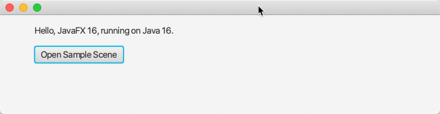
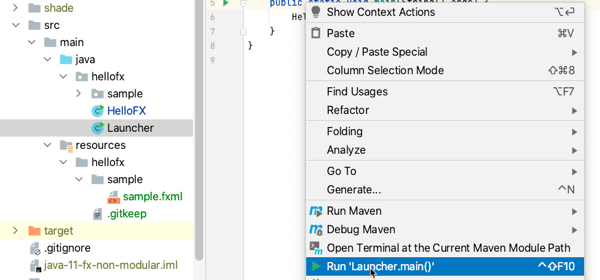
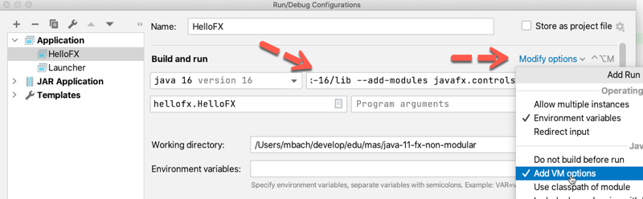
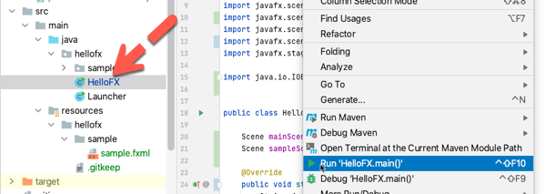
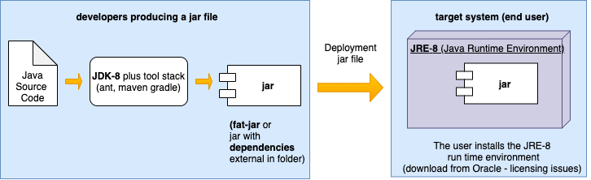
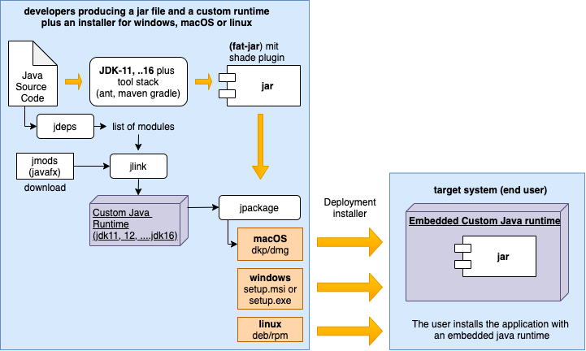
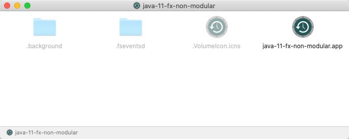
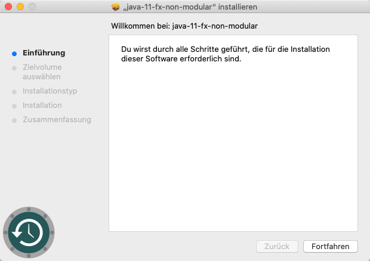
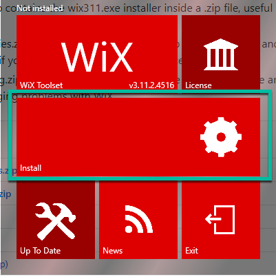

# Java JDK 11+ (JDK 16) and Fx16 Non-modular

[https://github.com/mbachmann/java-11-fx-non-modular](https://github.com/mbachmann/java-11-fx-non-modular)

`java-11-fx-non-modular` sample non-modular project to run with Maven

## Run a JavaFx project

### Run with the javafx plugin

Enter in your terminal:

```
mvn javafx:run
```

Your output should look like:



<br/>

### Run in the IDE with a Launcher Class

The _Launcher Class_ is starting the application:



<br/>

### Run in the IDE with VM Options

Here the instructions for IntelliJ:

1. From the main menu, select Run | Edit Configurations.
2. Select Application | Main from the list on the left.
3. From the More options list, select Add VM options.

4. In the VM options field, specify the following options, but make sure to replace /path/to/javafx/sdk with the path the lib directory of the downloaded JavaFX SDK distribution (for example: /Users/jetbrains/Desktop/javafx-sdk-12/lib ):



<br/>

```
--module-path /path/to/javafx/sdk --add-modules javafx.controls,javafx.fxml
```

If your path contains spaces, wrap it in double quotes, for example: `"/Users/username/Desktop/My Folder/javafx-sdk-16/lib"`.

If you're using JavaFX SDK together with **OpenJDK**, add one more VM option:
```
--module-path /path/to/javafx/sdk --add-modules javafx.controls,javafx.fxml --add-exports javafx.graphics/com.sun.javafx.sg.prism=ALL-UNNAMED
```

<br/>

With the VM-Options in place you can run the application directly (without a launcher class):



<br/>

## Build the Fat-Jar

A Fat-Jar is a jar file including the dependencies from the _pom.xml_-file. The shade plugin is producing the _Fat-Jar_ in the
folder `shade`.


### Create a Fat-Jar on Linux, Mac or Windows with bash shell

If you run on Linux or Mac, follow these steps:

    cd to the folder java-11-fx-non-modular

To run the project:

    ./mvnw clean javafx:run

To create a fat jar:

    ./mvnw clean compile package
    java -jar shade/java-11-fx-non-modular.jar


### Create a Fat-Jar on Windows with cmd.exe

If you run on Windows, follow these steps:

    cd to the folder java-11-fx-non-modular

To run the project:

    mvnw compile javafx:run

To create a fat jar:

    mvnw clean compile package
    java -jar shade\java-11-fx-non-modular.jar

## jpackage for platform dependant setup (MacOs or Windows)

[JPackage Doku](https://docs.oracle.com/en/java/javase/14/jpackage/packaging-tool-user-guide.pdf)

The deployment of Java application has changed from _Java 8_ to _Java 11_ and later releases.

### Deployment of Java 8 applications

The deployment of Java 8 applications consists of some  **jar-files**
including the necessary dependencies. The customer needs to install a _JRE-8 runtime_ on his _target_ system.

[Java SE Runtime Environment 8 ](https://www.oracle.com/ch-de/java/technologies/javase-jre8-downloads.html)

The correct execution of a _Java-8_ application ist dependant of the correct installation and version of a _JRE-8_ on the _target_ system.

<br/>



<br/>

### Deployment of Java 11+ applications

The deployment of a _Java 11+_ application has changed in comparison to _Java 8_. There is **no separate JRE** available anymore.
A _custom JRE_ is created by the developers for each java project individually including the necessary components.

_Java 9_ introduced a new level of abstraction above packages,
formerly known as the Java Platform Module System (JPMS), or “Modules” for short.
Java itself consists of a set of modules:

```
java --list-modules
```

These modules are split into two major groups: java and jdk.

- java modules are the implementation classes for the core SE Language Specification.
- Anything needed by the JDK itself is kept in the jdk modules.

Java projects can be created as _modular_ or _non-modular_ project. The word _non-nodular_ defines
that no _modules.info_ file is available in the project.

The deployment of a Java11+ application requires some new tools:

- **jlink** is a tool that generates a custom Java runtime image that contains only the platform modules that are required for a given application.
- **jdeps** is a tool that generates a list of modules. In order to use jlink, we need to know the list of the JDK modules that the application uses and that we should include in our custom JRE.
- **jpackage** (introduced with _JDK-14_) tool packages a Java application into a platform-specific package that includes all of the necessary dependencies. The application may be provided as a collection of ordinary JAR files or as a collection of modules.

<br/>



<br/>

For an installer of an _JavaFx application_, there are some extra modules (jmods) required.
The _jmods_ are platform dependant and can be downloaded from:

[JavaFX - Gluon](https://gluonhq.com/products/javafx/)

We can list the dependencies of the Fat-Jar:

```
jdeps --list-deps shade/*.jar
```

Your output should look like:

```
   java.base
   java.desktop
   java.scripting
   java.xml
   jdk.jfr
   jdk.unsupported

```


## Icon Download

If you need some specific icons for your installer and for your application make sure you have several icon formats available;

- Windows: .ico format
- macOS: .icns format
- Linux: .png format

Ready to use icons can be downloaded from several sources:

- https://iconarchive.com/tag/mac-icns

## Create an Installer for macOS

### Prerequisites

Please make sure you have the XCode command line tools installed:

Enter the following command in your terminal

```
xcode-select --install
```

### Create a Custom Runtime Image for macOS

With jlink we can create a custom runtime for macOS. Make sure your have built the _Fat-Jar_ and downloaded the _javafx-jmods_.
The _javafx-jmods_ are in the folder `install/macos/javafx-jmods-16`.
Before running jlink delete an existing Runtime image in the folder `install/macos/jdk16+fx`.

```
jlink \
  --output install/macos/jdk16+fx \
  --module-path install/macos/javafx-jmods-16 \
  --add-modules javafx.base,javafx.controls,javafx.fxml,java.logging
```

Since we have a custom runtime image we can run the Fat-Jar with it:

```
install/macos/jdk16+fx/bin/java -version
install/macos/jdk16+fx/bin/java -jar shade/java-11-fx-non-modular.jar 
```

### Create an dmg-installer from the Fat-Jar including Custom Runtime Image

We are using the created runtime image. Before running jpackage delete an existing Installer in the folder `install/output`.
Custom icons can be placed in the folder `install/macos/resources`.

```
jpackage \
  --input shade/ \
  --name java-11-fx-non-modular \
  --main-jar java-11-fx-non-modular.jar \
  --main-class hellofx.Launcher \
  --description "Java Fx Non Modular Example" \
  --vendor "ZHAW" \
  --icon install/assets/icon.icns \
  --dest install/output \
  --app-version 1.0 \
  --runtime-image install/macos/jdk16+fx \
  --resource-dir install/macos/resources \
  --type dmg
```

Copy the installer from the _install/output_ to your desktop and start the installer.



<br/>

### Create an pkg-installer from the Fat-Jar (Custom Runtime Image is created)

Instead of using a runtime image, we can create it on-the-fly.  
Before running jpackage delete an existing Installer in the folder `install/output`.
Custom icons can be placed in the folder `install/macos/resources`.

```
jpackage \
  --input shade/ \
  --name java-11-fx-non-modular \
  --main-jar java-11-fx-non-modular.jar \
  --main-class hellofx.Launcher \
  --description "Java Fx Non Modular Example" \
  --vendor "ZHAW" \
  --copyright "ZHAW" \
  --dest install/output \
  --app-version 1.0 \
  --icon install/assets/icon.icns \
  --module-path install/macos/javafx-jmods-16 \
  --add-modules javafx.base,javafx.controls,javafx.fxml,java.logging \
  --resource-dir install/macos/resources \
  --type pkg
```

<br/>

Copy the installer from the _install/output_ to your desktop and start the installer.
This time we have created a _pkg_ installer.



<br/>

## Create an installer for Windows

###  Prerequisites for Windows

Please make sure you have installed the Wix Tool Set


[Wix Tool Set](https://github.com/wixtoolset/wix3/releases/tag/wix3112rtm)

<br/>



<br/>


### Create a Custom Runtime Image for Windows

With _jlink_ we can create a custom runtime for macOS. Make sure your have built the _Fat-Jar_ and downloaded the _javafx-jmods_.
The _javafx-jmods_ are in the folder `install/windows/javafx-jmods-16`.

Before running _jlink_ delete an existing Runtime image in the folder `install/macos/jdk16+fx`.

```
jlink \
  --output install/windows/jdk16+fx \
  --module-path install/windows/javafx-jmods-16 \
  --add-modules javafx.base,javafx.controls,javafx.fxml,java.logging
```

Since we have a custom runtime image we can run the Fat-Jar with it:

```
install/windows/jdk16+fx/bin/java -version
install/windows/jdk16+fx/bin/java -jar shade/java-11-fx-non-modular.jar 
```

### Create an setup.exe installer from the Fat-Jar including a Custom Runtime Image

We are using the created runtime image.
Before running jpackage delete an existing Installer in the folder `install/output`.
Custom icons can be placed in the folder `install/windows/resources`.

```
jpackage \
  --input shade \
  --name java-11-fx-non-modular \
  --main-jar java-11-fx-non-modular.jar \
  --main-class hellofx.Launcher \
  --description "Java Fx Non Modular Example" \
  --vendor "ZHAW" \
  --icon install/assets/icon.ico \
  --dest install/output \
  --app-version 1.0 \
  --runtime-image install/windows/jdk16+fx \
  --resource-dir install/windows/resources \
  --win-shortcut \
  --win-dir-chooser \
  --win-menu \
  --win-menu-group "ZHAW Hello Fx" \
  --type exe
```

Copy the installer from the _install/output_ to your desktop and start the installer.

### Create an msi-installer from the Fat-Jar (Custom Runtime Image is created)

Instead of using a runtime image, we can create it on-the-fly.
Before running jpackage delete an existing Installer in the folder `install/output`.
Custom icons can be placed in the folder `install/windows/resources`.

```
jpackage \
  --input shade \
  --name java-11-fx-non-modular \
  --main-jar java-11-fx-non-modular.jar \
  --main-class hellofx.Launcher \
  --description "Java Fx Non Modular Example" \
  --vendor "ZHAW" \
  --copyright "ZHAW" \
  --dest install/output \
  --app-version 1.0 \
  --icon install/assets/icon.ico \
  --module-path install/windows/javafx-jmods-16 \
  --add-modules javafx.base,javafx.controls,javafx.fxml,java.logging \
  --resource-dir install/windows/resources \
  --win-shortcut \
  --win-dir-chooser \
  --win-menu --win-menu-group "ZHAW Hello Fx" \
  --type msi
```

Copy the installer from the _install/output_ to your desktop and start the installer.
This time we have created a _msi_ installer.


